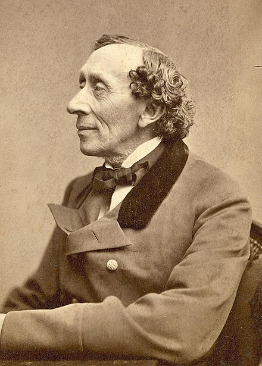

# 安徒生囡仔古選譯

## 目錄

## 紹介

漢斯·克里斯蒂安·安徒生是丹麥的作家。伊上出名的當然就是伊所寫的囡仔古，除了囡仔古以外，伊嘛捌作詩、寫小說。

《安徒生囡仔古》有超過 150 篇故事，其中，「皇帝的新衫」、「賣番仔火的查某囡仔」攏是通人知的囡仔古。

頂面的故事是對 1888 年 Susannah Mary Paull 翻作英語的安徒生童話翻來的。
你會當佇[維基文庫](https://en.wikisource.org/wiki/Hans_Andersen%27s_Fairy_Tales)揣著英語的版本。