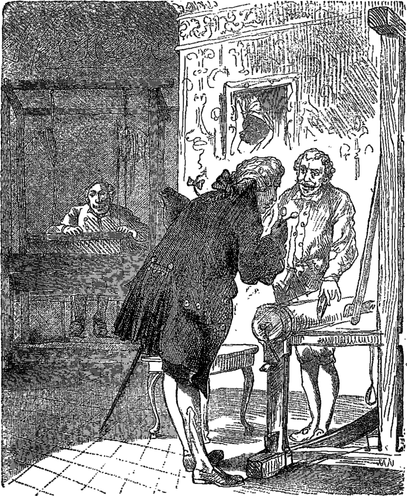

Many years ago, lived an emperor who was so very fond of new clothes, that he spared no expense in order to obtain as many fine dresses as possible.

He did not care about the soldiers of the army, and scarcely ever visited the theatre, and when he did drive out in his carriage it was only to show off his new clothes.

He had a different suit for every hour of the day, and his subjects, instead of saying, as they do in other kingdoms, “The king is in his council chamber,” here it was always said, “The emperor is in his dressing-room.”

The great city in which he dwelt was very gay, for every day strangers visited the town. On a certain day two men arrived who gave out that they were weavers, and possessed the secret of weaving the most beautiful fabric that eyes had ever seen. They pretended also that, although the rich colours and designs were as beautiful as the material, yet the latter had a wonderful power of becoming invisible, even when made into clothes, to everybody who was either unsuitable for his position or very stupid.

“To have clothes of such a material as that would just suit me,” thought the emperor. “If I wore them I should soon find out which men in my empire were suited to the positions they filled, and distinguish between the clever and the stupid. Yes, I must have some of that stuff woven for myself.” So he gave an order to the weavers, with a large sum of money in advance, so that they might begin their work immediately.

The impostors set up two weaving looms, and pretended to be at work, but there was nothing on the looms at all. Then they asked for the finest and the costliest thread of gold and silk, all of which they stowed away safely in a bag, and then worked the empty looms all night.

“I should like to know how the weaving gets on,” thought the emperor; but he was greatly troubled with a fear that if he could not see this wonderful stuff on the looms, his subjects would think he was stupid, or not fit for his position.

But at last he decided that he could have no cause to fear, yet he would send some one else to look at the looms first, and see how the weaving was progressing.

Everyone in the whole city knew what a very strange power the fabric had, and were longing to find out how many would be found unfit for their position, or how the stupidity of their neighbours might be discovered.

“I will send my high-principled old minister to the weavers,” thought the emperor; “he will be quite able to discover how the weaving progresses, for he is a sensible man and more fitted for such an office than any one else.”

 THE MINISTER VISITING THE WEAVERS. 

So the good old minister went to the hall where the impostors were working at their bare looms. “Heaven defend us!” he thought, as he gazed at the looms with wide open eyes; “why I cannot see anything at all;” but he did not utter his thoughts aloud.

The two rogues were very polite; they asked him to step nearer, and inquired whether he did not think the pattern very pretty and the colours brilliant.

The poor old gentleman went forward with eyes open still wider than ever, but he could see nothing, for there was nothing to see.

“Good gracious!” he said to himself, “am I becoming stupid or unfit for my position? I never should have believed it; at the same time I cannot understand why I can see nothing on the weavers’ looms.”

“Now, what do you think of our work?” asked the two weavers.

“Oh, it is beautiful, lovely,” said the bewildered old gentleman, looking through hig spectacles. “What a magnificent design, and what gorgeous colouring. Yes, I shall tell the emperor I approve of all I have seen very much,”

“We are charmed to hear this,” they said, as they pointed out the beauty of the pattern and the colours.

The old minister listened attentively, that he might be able to explain it all to the emperor in the same words, which he did very correctly.

After this the impostors applied for more money in advance and more gold and silken thread, which they readily obtained, and also stowed away in the same bag. Then they continued their pretended work at the looms, but not a single thread was used.

The emperor soon after sent another statesman to see how the weaving was going on, and to inquire whether the stuff would soon be ready. But it was exactly the same with him as with the first. He almost made himself half blind with looking; but as there was nothing on the looms, he could see nothing.

“I am not stupid,” said the man to himself; “I suppose, therefore, I am not fitted for my situation. That, however, is a ridiculous idea, but I must not say a word about it to anyone.” So he praised the tissue he could not see, and told the weavers how greatly he admired the design and the colours. “It is really lovely,” he said to the emperor.

Everyone in the city now talked about the beautiful fabric, and then the emperor expressed a wish to see for himself what this wonderful stuff was like, while still on the loom. He took a number of gentlemen with him, among whom were the two honest statesmen who had been there already.

The emperor approached the looms at which the two artful impostors were working with all their might, although there was not a single thread on the looms.

“Is it not magnificent?” exclaimed the two honest statesmen who already knew all about it. “Will your majesty come a little nearer, and examine the pattern and the bright colours?” The looms appeared empty and bare when they pointed to them, but they believed that every one but themselves would see the material plainly.

“How is this?” said the emperor to himself. “I can see nothing; this is really dreadful. Am I stupid? Am I, as emperor, unfit for my position? It would be the most dreadful thing if that could happen to me. Oh, really, it isvery beautiful,” he said, aloud; “it merits my highest approval in every way;” and he nodded as if quite satisfied at the bare looms, for he would not own that he saw nothing.

All, however, who accompanied the emperor saw no more than he did, yet they agreed with him, when he said again, “Yes, it is very beautiful,” and advised him to have some new clothes made of this magnificent fabric, to wear at the first grand procession. “How delightful! how charming! excellent!” sounded from mouth to mouth, and every one seemed contented, especially when the emperor, decreed that the two weavers should in future bear the title of “Court Weavers.”

The impostors were up the whole night before the day of the grand procession, and had more than twenty lights burning, so that people could see that they were busily at work on the emperor’s new clothes.

They moved their hands as if they were taking the cloth from the loom; they cut with their great scissors in the air, and sewed with needles that held no thread, and said, at last, “See, now, the clothes are quite ready.”

By-and-by the emperor himself arrived with the greatest of his noblemen, and both impostors raised one arm, just as if they were holding something up and said, “Here are the trousers, there is the coat, and here the cloak,” and so forth; “all as light as a spider’s web, so that anyone who wears them might believe he had nothing on, but that is one beauty of the clothes we prepare.”

“Yes,” they all exclaimed; yet they could see nothing, for there was nothing to be seen.

“If your imperial majesty will now please to take off the old clothes,” said the impostors, “we will then dress you in the new ones here, before this large looking-glass.”

The emperor took off his clothes, and the impostors pretended to help him in putting on one article after another of the new clothes, while he twisted and turned himself about before the looking-glass.

“Oh, how becoming they are! how beautifully they fit!” was the general remark; “and the patterns and colours are wonderful; it is truly an imperial dress.”

The master of the ceremonies then appeared and said, “The canopy which is to be carried over your imperial majesty in the procession is quite ready.”

“Well, I am ready also,” said the emperor. “Does not everything fit me well!” And he turned himself about once more before the lookingglass as he spoke, for he wished it to appear that he was admiring himself in his pretty finery.

The pages who were to carry the train stooped and pretended to lift something from the ground, as if they were raising the train, and then followed the emperor, for they also were unwilling for it to be known that they could see nothing.

And thus the emperor walked in the procession under the magnificent canopy, and all the people in the streets and at the windows said.

“Dear heaven! what splendid clothes the emperor has on, and how well they fit! and is not the train magnificent!”

No one dared to make the remark that they saw nothing, for whoever should do so would be at once considered stupid or unfit for his office. None of the emperor’s new clothes had ever been so successful as these.

“But the emperor has no clothes on!” said a little child at last.

“Good heavens!” exclaimed the father, “listen to the voice of that little innocent child.” And as the words were whispered from one to another, the people at once cried out.

“Well, it is true; he has no clothes on!”

And the emperor heard it, and was terribly puzzled, for it appeared to him they were right; but he said to himself, “Now that I have begun the procession, I must go on to the end.” So the pages still pretended to carry the emperor’s train, although they knew it really did not exist.