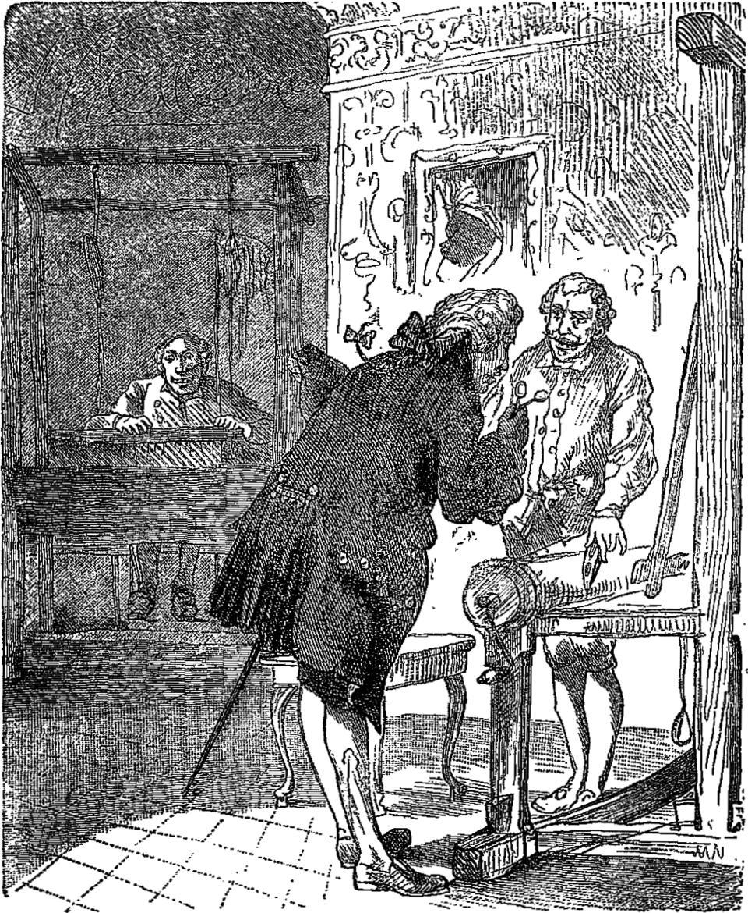

 
<h1 style="text-align:center"> 國王的新衫 </h1>
 

真久真久以前，有一位足愛買新衫的國王。為著欲買新衫，偌濟錢伊攏願意開。

伊無咧管軍隊的兵仔，嘛罕得去看戲。若是坐馬車出門，就干焦是欲展伊新買的衫爾爾。

國王逐點鐘攏咧換衫。別的國家的人民可能會講「國王當佇咧開會」，但是遮的人會講「國王當佇列換衫」。

國王蹛的城市真鬧熱，逐工攏有足濟外國人來的。有一工，有兩个講家己是裁縫的人來到這個所在。𪜶（亻因）講𪜶（亻因）知影一種奇妙的方法，會用得車出全世界上媠的布料，媠到無人捌看過。𪜶（亻因）閣講這種布料做出來的五彩的衫媠罔媠，毋過有一種奇巧的性質，若是無夠格抑是戇呆戇呆的人，就算共布料做成衫猶是看袂著的。

「若是會當穿彼種布做成的衫，」國王咧想，「我就會使知影我的子民敢有夠格，嘛會使知影啥物人較巧、啥物人悾悾矣。無毋著，我一定欲穿著這領衫。」國王紲命令兩个裁縫趕緊開始做工課，嘛予𪜶（亻因）足濟錢的。

兩个諞仙仔提來兩台布機，假做咧做工課。毋過，布機頂懸啥物攏無。𪜶（亻因）閣要求愛予𪜶（亻因）上好的金仔佮上貴的紗仔，提著了後囥佇橐仔內，就繼續佇空空的布機邊無眠無日的做工。

「真想欲知影我的衫車到按怎矣。」國王想。毋過，伊驚若是家己看袂著布機頂懸鮮沢的衫，伊的部下會感覺伊毋是頇顢就是無夠格。

上尾，伊想著伊其實無啥好驚的，只要先派人去看這馬車到按怎毋就好矣。

這个怪奇的布料佇城內是通人知的，若是去予人發現家己無夠格抑是無夠巧，厝邊頭尾攏會知。

國王想，「不如請我彼个人範袂䆀的大臣去看好矣。我看伊肯定看會著彼領衫的，閣較講，伊嘛是理智閣稱職的人。」

 大臣去看裁縫。 

老大臣來到諞仙仔做工的房間。「哎喲喂！我哪會啥物攏看無。」大臣看著空空的布機著生驚，毋過伊並無喝出聲。

兩个佬仔真有禮貌的請大臣倚去看，閣問伊感覺花草敢有媠、色水敢豔色。

可憐的大臣目睭擘金金，無過猶是啥攏看無。究其然布機頂懸本底就啥物攏無。

「哪會按呢！我按呢是傷過戇抑是無夠格？」大臣對家己講，「我實在是無想欲相信，我哪會真實啥攏看無？」

「啊你感覺按怎？」裁縫問大臣。

「喲，閣真實媠噹噹咧，」大臣用伊的目鏡看，「我無看過遮爾精巧的花草，伊的色緻嘛真媠款。誠好，我會共國王講我真滿意恁做的衫的。」

「誠歡喜聽著你按呢講。」裁縫那講，那用指頭仔去比彼領衫好看的花草佮色水。

大臣聽甲誠斟酌，那聽那記。伊共聽著的話共國王講，一字攏無落勾。

兩个佬仔閣再要求更加較濟的黃金佮紗仔，提著了後，又閣囥佇仝款的橐仔內底。𪜶（亻因）繼續假做咧做代誌，毋過布機猶是空空。

無過偌久，國王閣遣另外一个人去看這馬的進度，順紲問看𪜶（亻因）敢欲完成矣。猶毋過，這擺的結果猶是仝款，布機本底就啥物攏無，閣再看嘛是看無。

「我都無咧戇，」彼个人想，「若是我看無，敢就代表講我無夠格？哎呦，遮爾譀古的代誌，我是袂予別人知的。」伊共裁縫呵咾講𪜶（亻因）用的布足媠的，花草佮色水嘛誠好看。「看起來真正袂䆀。」伊共國王報告的時按呢講。

Everyone in the city now talked about the beautiful fabric, and then the emperor expressed a wish to see for himself what this wonderful stuff was like, while still on the loom. He took a number of gentlemen with him, among whom were the two honest statesmen who had been there already.

The emperor approached the looms at which the two artful impostors were working with all their might, although there was not a single thread on the looms.

“Is it not magnificent?” exclaimed the two honest statesmen who already knew all about it. “Will your majesty come a little nearer, and examine the pattern and the bright colours?” The looms appeared empty and bare when they pointed to them, but they believed that every one but themselves would see the material plainly.

“How is this?” said the emperor to himself. “I can see nothing; this is really dreadful. Am I stupid? Am I, as emperor, unfit for my position? It would be the most dreadful thing if that could happen to me. Oh, really, it isvery beautiful,” he said, aloud; “it merits my highest approval in every way;” and he nodded as if quite satisfied at the bare looms, for he would not own that he saw nothing.

All, however, who accompanied the emperor saw no more than he did, yet they agreed with him, when he said again, “Yes, it is very beautiful,” and advised him to have some new clothes made of this magnificent fabric, to wear at the first grand procession. “How delightful! how charming! excellent!” sounded from mouth to mouth, and every one seemed contented, especially when the emperor, decreed that the two weavers should in future bear the title of “Court Weavers.”

The impostors were up the whole night before the day of the grand procession, and had more than twenty lights burning, so that people could see that they were busily at work on the emperor’s new clothes.

They moved their hands as if they were taking the cloth from the loom; they cut with their great scissors in the air, and sewed with needles that held no thread, and said, at last, “See, now, the clothes are quite ready.”

By-and-by the emperor himself arrived with the greatest of his noblemen, and both impostors raised one arm, just as if they were holding something up and said, “Here are the trousers, there is the coat, and here the cloak,” and so forth; “all as light as a spider’s web, so that anyone who wears them might believe he had nothing on, but that is one beauty of the clothes we prepare.”

“Yes,” they all exclaimed; yet they could see nothing, for there was nothing to be seen.

“If your imperial majesty will now please to take off the old clothes,” said the impostors, “we will then dress you in the new ones here, before this large looking-glass.”

The emperor took off his clothes, and the impostors pretended to help him in putting on one article after another of the new clothes, while he twisted and turned himself about before the looking-glass.

“Oh, how becoming they are! how beautifully they fit!” was the general remark; “and the patterns and colours are wonderful; it is truly an imperial dress.”

The master of the ceremonies then appeared and said, “The canopy which is to be carried over your imperial majesty in the procession is quite ready.”

“Well, I am ready also,” said the emperor. “Does not everything fit me well!” And he turned himself about once more before the lookingglass as he spoke, for he wished it to appear that he was admiring himself in his pretty finery.

The pages who were to carry the train stooped and pretended to lift something from the ground, as if they were raising the train, and then followed the emperor, for they also were unwilling for it to be known that they could see nothing.

And thus the emperor walked in the procession under the magnificent canopy, and all the people in the streets and at the windows said.

“Dear heaven! what splendid clothes the emperor has on, and how well they fit! and is not the train magnificent!”

No one dared to make the remark that they saw nothing, for whoever should do so would be at once considered stupid or unfit for his office. None of the emperor’s new clothes had ever been so successful as these.

“But the emperor has no clothes on!” said a little child at last.

“Good heavens!” exclaimed the father, “listen to the voice of that little innocent child.” And as the words were whispered from one to another, the people at once cried out.

“Well, it is true; he has no clothes on!”

And the emperor heard it, and was terribly puzzled, for it appeared to him they were right; but he said to himself, “Now that I have begun the procession, I must go on to the end.” So the pages still pretended to carry the emperor’s train, although they knew it really did not exist.