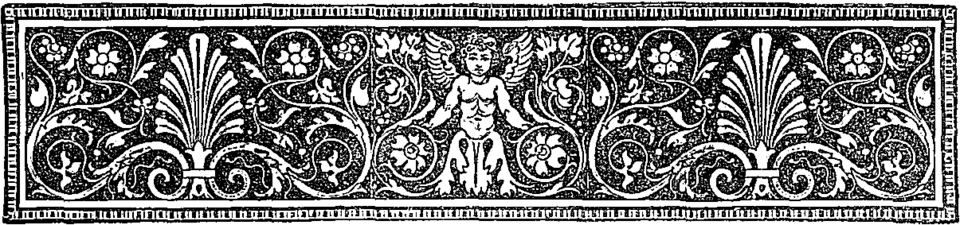
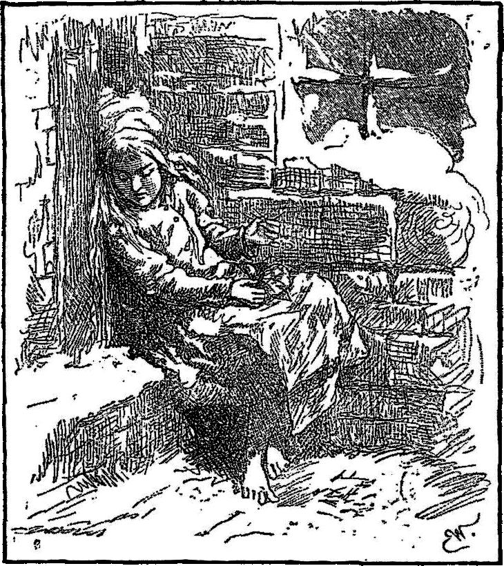

 
<h1 style="text-align:center"> 賣番仔火的查某囡仔 </h1>
 

猶會記得有一年的寒人特別冷，四界暗趖趖，大雪干焦無欲停的款。佇咧烏暗的大路頂懸，有一个可憐的查某囡仔褪赤跤行來行去。伊拄才出門的時陣猶閣有穿鞋，但是彼雙鞋是伊阿母的，對細漢囡仔來講實在是傷過大矣。為著欲閃避兩台直接挵過來的馬車，鞋仔無細意就飛去矣。其中一支已經揣無矣，另外一支去予一个查埔囡仔搶去，閣講等伊未來的紅嬰仔出世，就會使共鞋仔當作搖笱用。可憐的查某囡仔無奈何，只好褪赤跤，用伊紅到變青的跤繼續行。查某囡仔舊舊的 e-pú-lóng 裡底有幾若枝番仔火，手中嘛有幾枝。但是規工落來，無人捌共伊買過番仔火，嘛無人捌寄付過一箍銀。查某囡仔無物通食，寒甲爍爍顫，實在是可憐代。雪落到伊長到相絞起來的頭毛頂懸，猶毋過這對伊已經無要緊了。

路邊的窗仔門光映映，閣有人兜佇咧食芳貢貢的烘鵝。查某囡仔知影，今仔日是二九暝。伊坐佇咧兩棟樓房中央的邊仔角，共家己攬咧，閣坐佇家己的跤頂懸。就算按呢，伊猶是感覺足冷的。查某囡仔半枝番仔火攏無賣出去，實在是毋敢轉去厝裡。哪是一仙五厘攏無趁到，伊的阿爸會共伊㧌落去；閣再講，轉去嘛無較溫暖，厝裡的壁堵已經攏破空矣，干焦上大的空有用稻草佮破布窒起來爾爾。查某囡仔的手寒甲欲結凍。啊！哪是點一枝番仔火敢若袂䆀。只要有體力共番仔火提出來，用邊仔的壁戛火，就會使共指頭仔焐予燒。She drew one out—“scratch!” how it sputtered as it burnt! It gave a warm, bright light, like a little candle, as she held her hand over it. It was really a wonderful light. It seemed to the little girl that she was sitting by a large iron stove, with polished brass feet and a brass ornament. How the fire burned! and seemed so beautifully warm that the child stretched out her feet as if to warm them, when, lo! the flame of the match went out, the stove vanished, and she had only the remains of the half-burnt match in her hand.

She rubbed another match on the wall. It burst into a flame, and where its light fell upon the wall it became as transparent as a veil, and she could see into the room. The table was covered with a snowy white table-cloth, on which stood a splendid dinner service, and a steaming roast goose, stuffed with apples and dried plums. And what was still more wonderful, the goose jumped down from the dish and waddled across the floor, with a knife and fork in its breast, to the little girl. Then the match went out, and there remained nothing but the thick, damp, cold wall before her.

She lighted another match, and then she found herself sitting under a beautiful Christmas-tree. It was larger and more beautifully decorated than the one which she had seen through the glass door at the rich merchant’s. Thousands of tapers were burning upon the green branches, and colored pictures, like those she had seen in the show-windows, looked down upon it all. The little one stretched out her hand towards them, and the match went out.

The Christmas lights rose higher and higher, till they looked to her like the stars in the sky. Then she saw a star fall, leaving behind it a bright streak of fire. “Some one is dying,” thought the little girl, for her old grandmother, the only one who had ever loved her, and who was now dead, had told her that when a star falls, a soul was going up to God.

She again rubbed a match on the wall, and the light shone round her; in the brightness stood her old grandmother, clear and shining, yet mild and loving in her appearance. “Grandmother,” cried the little one, “O take me with you; I know you will go away when the match burns out; you will vanish like the warm stove, the roast goose, and the large, glorious Christmas-tree.” And she made haste to light the whole bundle of matches, for she wished to keep her grandmother there. And the matches glowed with a light that was brighter than the noon-day, and her grandmother had never appeared so large or so beautiful. She took the little girl in her arms, and they both flew upwards in brightness and joy far above the earth, where there was neither cold nor hunger nor pain, for they were with God.

In the dawn of morning there lay the poor little one, with pale cheeks and smiling mouth, leaning against the wall; she had been frozen to death on the last evening of the year; and the New-year’s sun rose and shone upon a little corpse! The child still sat, in the stiffness of death, holding the matches in her hand, one bundle of which was burnt. “She tried to warm herself,” said some. No one imagined what beautiful things she had seen, nor into what glory she had entered with her grandmother, on New-year’s day.